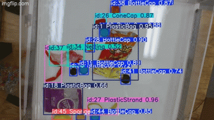

# Model Overview
* Model Name:  
YOLOv11 Trash Object Detection Model  
  
* Description:  
A real-time tracking system using a `YOLOv11` model to automate high-resolution pollution monitoring. It trains on the image dataset from `OceanCV` of trash in a water tank. This project aims to assist marine scientists, policy-making, and the protection of ocean life.



### Intended Use
Primary Use Case: 
* Object detection of trash in water to monitor marine pollution  
  
Future Applications:
* Large-scale coverage using aerial and georeferenced imagery via drones
* Combine with remote sensing instruments to map hotspots of unique spectral signatures of plastic material
* Long-term and scalable marine pollution tracking to create a vast time-series of marine image data  

Advantages:
* Faster image processing of floating debris compared to manual labor 
* Cost efficient with automated systems, reducing the need for human-driven expedition 
* Improved data accuracy in count and classification, removing human error and personal bias

### Metrics 
Overall mAP: `0.9524`
  
Class-Specific mAP
* Bottle Cap: 0.991
* Cone Cap: 0.914
* Leaf: 0.995
* Netting: 0.791
* Plastic Bag: 0.995
* Plastic Strand: 0.985
* Sponge: 0.995

Average latency: `10.76` ms  
FPS: `92.97`  
  

  

### Evaluation
Dataset Details:
* Number of Images: `189`
* Total Number of Class: `7`
* Total Count of Annotations: `3,952`
* Training Configuration:
  * Image Size: `640x640`
  * Batch Size: `64`
  * Optimizer: SGD (`lr=0.01`, `momentum=0.9`)
  * Hardware: AMD 7700XT GPU using ROCm and WSL
* Augmentations: None

### Recommendations
* Optimal Performance:
* Underrepresented Classes:
* Review Pipeline: Manual verification in workflows
* Downstream Tasks: (clustering, two-shot fine-tuning, in-depth analytics)
* Real-Time Inference: YOLO model

### Caveats and Limitations

### Bias, Risks, and Harms
Potential Biases:
* Imbalances class distribution may affect performance on underrepresented classes  
  
Mitigation Strategies:
* Rebalance Train/Validation splits
* Appropriate representative classes

# Prerequisites
* Install a compatible version of `PyTorch` for your GPU
* Either download the dataset directly from this repo, or use RoboFlow pipeline in the notebook
* Visual C++ and ODBC Driver is needed if you plan to use a SQL Server Database

```bash
# Dependencies for YOLO model

!pip install ultralytics
```

```bash
# Database connection and dataset
!pip install pyyaml pyodbc roboflow
```

```bash
# General installations
!pip install ipython torch torchvision tensorboard albumentations opencv-python
```
